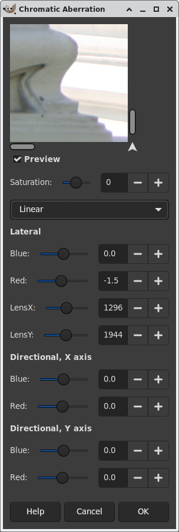
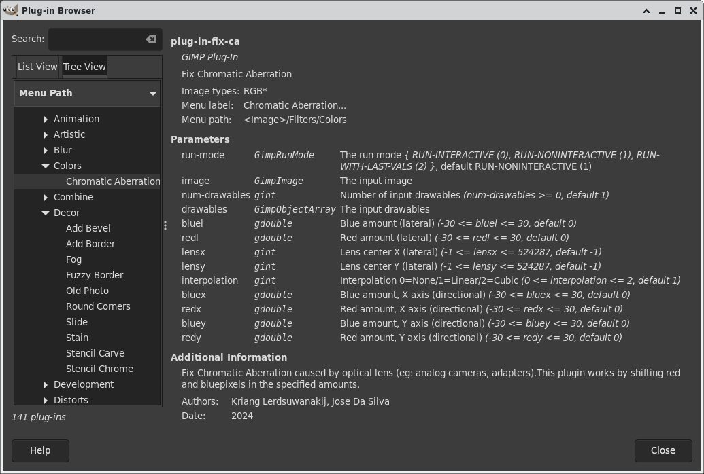

# GIMP3-Fix-CA

## Overview

GIMP3-Fix-CA is a [GIMP](http://www.gimp.org/) plug-in to correct Chromatic Aberration
(CA). For a general explanation about Chromatic Aberration, you can find information
from [Wikipedia](http://en.wikipedia.org/wiki/Chromatic_aberration).
GIMP3-Fix-CA can fix Lateral CA colored fringing caused by light traveling through
lenses, and Directional CA caused by light traveling through dense material such as
glass or water.

GIMP2-Fix-CA was written by Kriang Lerdsuwanakij lerdsuwa@users.sourceforge.net, and
several patches and improvements were later added in 2023,2024 by Jose Da Silva.
GIMP3-Fix-CA uses a lot of the same code with modifications to run for GIMP3.
Fix-CA is distributed under [GNU General Public License Version 3](COPYING) (GPLv3).


## Using GIMP3-Fix-CA

Fix-CA plug-in can be accessed via the menu 'Filters->Colors->Chromatic Aberration'

There are two types of Chromatic Aberration that can be corrected by GIMP3-Fix-CA:
Lateral and Directional.

### Lateral CA

Lateral Chromatic Aberration appears due to
[light passing through a lens](https://www.google.com/search?q=prism+light).
You may notice this effect with older analog cameras, or photographs, while newer
quality cameras may use methods to help reduce or cancel this effect, and digital
all-in-one cameras and smartphones can easily correct using software formulas
(similar to Fix-CA for their own lenses).

For this type of CA, the center of the image seen by the lens has no CA and the CA
gradually increases toward the edges.  Ideally, the original camera image, rather
than a cropped version, should be used to eliminate this type of CA.
If you are using a cropped image, you need to know approximately where the lens
center is located and then correct for this based off of the lens center.

Below is the image used to demonstrate Fix-CA plug-in capability
[full sized original here](img-fix-ca/full-Wat_Pathum_Wanaram.jpg) available under the
[GNU Free Documentation License Version 1.2 (GFDL) license](http://www.gnu.org/licenses/fdl.html).


This is a photo of Wat Pathum Wanaram, a buddhist temple next to Siam Paragon,
a major shopping mall in Bangkok. The areas of interest are marked with green
rectangles. Note that the reduced size here is only for display purposes here.

The actual processing is done on the full sized image (with green pixels left in
same positions "as-is", and the blue or red pixels are moved outwards or inwards.

Below are 200% zoom of the four areas before processing. The Chromatic Aberration
(CA) is visible on these images as red and blue lines around bright areas.


Normally it is not noticeable in the final image unless you are looking for this,
but can be quite visible when the image is cropped to a smaller area and then
expanded.

Invoking Fix-CA plug-in using the menu 'Filters->Colors->Chromatic Aberration'
with the 'Lateral' settings shown below can help improve this image.



When you are going to correct for Lateral CA, you should look around the edges.

The corners tend to have the worst Lateral CA, and you begin correcting there.
If you correct one corner, the rest of the picture should look okay too, therefore
check the other corners and edges using preview ON/OFF as you look around.
If the image center is not the lens center, or some alignment is off, then you
will want to move the lens center around a little bit a little bit off center,
and then check the corners and edges again until it looks okay to you.
The poor man's zoom of the branches (shown below) is an example you can try where
the lens center is off-center, and the lens alignment may be a little skewed too.

In the dialog box, setting red to -1.5 will shift the red channel inward to
the maximum of 1.5 pixels. Here the positive number means moving outward,
while the negative number means inward. Since the orientation of this photo
is portrait, the red channel of top and bottom border will move by 1.5 pixels.
Pixels at the inner part the red channel will be moved less while the pixels
at the center of image will not be moved at all. (For a landscape image, the
left and right border will be moved by 1.5 pixels instead).

The LensX=1296/LensY=1944 is the image center, which is also the assumed optical
lens center. The lens center point can be moved around if you find one side needs
more correcting than the other side. Setting LensX=-1/LensY=-1 is also the same
as choosing the image center.

The interpolation parameter controls how the plug-in deals with fractional
pixels, for example, if the plug-in decides to move an image pixel by 0.8
pixel, 'Linear' and 'Cubic' settings will try to get a value by averaging
the surrounding pixels while 'None' will pick the nearest pixel (for this
example by moving 1 full pixel).

The 'Preview saturation' setting changes the saturation for the preview image.
This helps you spot CA problems. This setting does not have any effect on the
final image produced by this filter.

Below is the 200% zoom for the resulting change using the above corrections.


In this example above we need to trade off between bottom right area (which
suffers from less CA) and the left area (the most CA).

Now that we know one side has more CA than the other, we can improve this image
further by moving the lens center towards the direction of less CA...

If we move the lens center right to approx LensX=1406, and increase Red=-2.0
due to the added distance on the left, this seems to resolve both left and right
sides. If you look at the bottom left corner, you will see some blue beginning
to appear, so if you change Blue=+0.6 this seems to fix that too.

It appears the lens on this camera is a little off-center to the right.

For the majority of your pictures and images, you can assume the lens center is
also at the image center (unless you notice more left/right or up/down CA), or
if you are working with a cropped picture which may have the center elsewhere.

Today's digital self-contained cameras are unlikely to have lateral problems
since they likely have built in software to correct for lateral problems, but you
can probably expect some amount of lateral CA for older analog type cameras.

Below is an example image using a poor man's zoom attached to a smartphone.
Even though a smartphone can correct an image for it's own lens, the poor man's
zoom attachment adds Lateral CA as well as having the lens center off to one side.


To correct this, you may notice the pixel corrections seem like large values
like 6.0, but this applies to the (black) corners, and reduces down to about
3.0 around the edges of where the lens image begins, eventually a zero pixel
shift what seems to be a lens center of LensX=658/LensY=1280.


Below is a Preview (off) of the leaves (showing blue). This can be corrected
using the Lateral CA settings shown above (can be seen with Preview on).


The [full sized original is here](img-fix-ca/full-branches.jpg).


### Directional CA

In Directional Chromatic Aberration, the amount of CA is assumed to be the
same throughout the image.  This happen, for example, when photographing
fish in an aquarium.  Light travels through dense water and glass and bends
differently depending on the color and angle from the glass.

This example is a complete photo of a sleeping sea turtle.


The image below is the turtle head at a zoom of 50%.
CA is severe and noticeable at this zoom level.


The amount of CA is roughly the same throughout the image. Starting from the
original, shown above.

By adjusting Directional X-axis CA amount and Y-axis amount to shift color
component around, the result is quite good with the settings shown below.

 

The picture below shows (50% zoom) corrected image of the interested region.


## Download and building GIMP3-Fix-CA

To compile and install this plug-in, you will need the GIMP3 RC1 version or
later. Then run these commands in the main directory for this project:
```sh
  autoreconf -i
  automake
  ./configure --prefix=/usr
  make
```
You can also run 'make check' if you want, but note it takes about a minute to
process since it loads and runs `gimp-3.0 -i` without a display.

At this point, the binary fix-ca is ready to install.
For a single user, or someone without administration/root priviledges, you can
install fix-ca into your local home directory as:
```sh
  gimptool --install-bin fix-ca
```
or if you have administrative/root access, you can install fix-ca for everyone
to use as:
```sh
  sudo make install
```
which then installs fix-ca as /usr/lib64/gimp/3.0/plug-ins/fix-ca/fix-ca
and the locale files into /usr/share/locale/??/LC_MESSAGES/gimp30-fix-ca.mo

If GIMP3 is already running in your system, exit and restart Gimp for the new
plug-in to be detected. The following displays GIMP3-Fix-CA information from
the GIMP3 menu.



## Installation method

Developers and Distro installers will be more interested in this install method.
This method also includes local language support (for included languages).

```sh
  autoreconf -i  (or use 'autoreconf --install --force' for some setups)
  automake --foreign -Wall
  ./configure --prefix=/usr
  make
  make check
  sudo make install
```
NOTE: At this time `make check` can be run manually on the terminal, but is not
ready to run yet in scripts that have no display, such as rpm spec files or debian
build files. Gimp is still in release candidate mode and bugs are getting fixed.

## Version History

GIMP3-Fix-CA
- 0.1 (Nov 14, 2024) Ready for GIMP3-RC1 (Release Candidate 1 - Ready for larger audience, API expected to be stable).
- 0.0 (May 15, 2024) Pre-release (GIMP3 >= 2.99.19^20240515 - API is not stable yet).

GIMP2-Fix-CA
- 4.0 (February 29, 2024) Upgraded code to use GIMP-2.10 API. Now Gimp-Fix-CA works with RGB/RGBA with precisions of 8bit, 16bit, 32bit, or double for each color of R,G,B,A. Also added Lens X/Y center and a lens centerline in the preview window. Local Language support now included for the installable Gimp-Fix-CA. This version is bumped to 4.0 since it requires GIMP-2.10.xx, and also because non-interactive scripting also requires Lateral Lens X/Y positions (default=-1,-1)
- 3.0.4 (December 2, 2023) mostly edits around make system. Minimal mods to fix-ca.c code (which needs updating).
- 3.0.3 (October 8, 2022) autoconf/automake/configure/make added for building fix.ca
- 3.0.2 (December 22, 2007) Add the missing tile cache that speed up preview.
- 3.0.1 (July 5, 2007) Fix a bug involving image row cache that cause bad CA correction when the number of pixel moved is large.
- 3.0.0 (July 3, 2007) Add CA fix in X and Y axis.
- 2.1.0 (January 24, 2007) Add saturation in preview. (Suggested by Reiner.)
- 2.0.0 (December 5, 2006) Improve speed. Add linear and cubic interpolation.
- 1.0.0 (November 30, 2006) First version.


Note: The Original Web page content and pictures are copyrighted (c) 2006, 2007
by Kriang Lerdsuwanakij. New Added images and web page content added 2022..2024
by Jose Da Silva are under the same license as this GPL3+ project.
